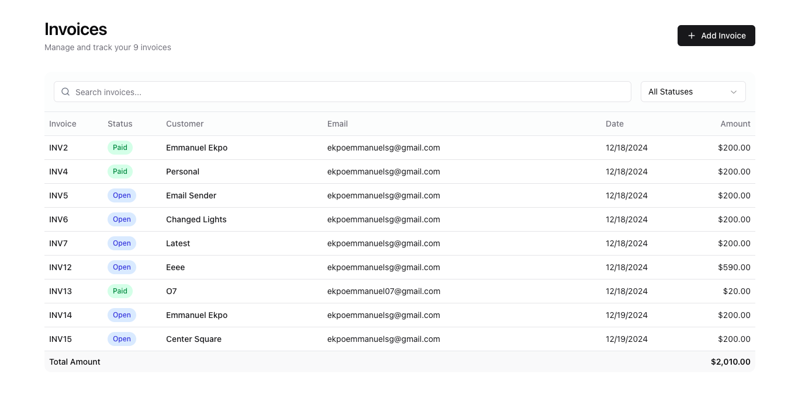

# Invoicedia - Invoicing Web App  

**Invoicedia** is a modern invoicing web application built with **Next.js**, designed to streamline the process of creating, managing, and tracking invoices for small businesses and freelancers.  


---

## Table of Contents  
- [Introduction](#introduction)  
- [Features](#features)  
- [Technologies Used](#technologies-used)  
- [Getting Started](#getting-started)  
  - [Installation](#installation)  
  - [Configuration](#configuration)  
- [Usage](#usage)  
- [Contributing](#contributing)  
- [License](#license)  
- [Contact](#contact)  

---

## Introduction  
Invoicedia simplifies invoice management by providing a user-friendly interface, real-time updates, and integrations with payment gateways. With responsive design and robust features, it’s tailored for professionals looking to enhance their invoicing workflow.

---

## Features  
- **Customizable Invoice Templates**  
  Personalize invoices with company branding.  

- **Client Management**  
  Store client details and manage projects seamlessly.  

- **Real-Time Calculations**  
  Automatically calculate totals, taxes, and discounts.  

- **Payment Integration**  
  Integrated with platforms like Stripe and PayPal for seamless payment collection.  

- **Export Options**  
  Generate PDF invoices or export data in CSV format.  

- **Dark Mode**  
  Enhanced usability with light and dark theme options.  

---

## Technologies Used  
- **Frontend**: [Next.js](https://nextjs.org/) (React Framework)  
- **State Management**: React Context API
- **Styling**: [ShadCN UI](https://shadcn.dev/) & [Tailwind CSS](https://tailwindcss.com/)  
- **Authentication**: [Clerk](https://clerk.dev/)  
- **Database**: [Xata](https://xata.io/) (PostgreSQL)  
- **ORM**: [Drizzle ORM](https://drizzle.team/)  
- **Payment Gateway**: Stripe/PayPal API integration 
- **Emails**: Resend

---

## Getting Started  

### Installation  
1. **Clone the Repository**:  
   ```bash  
   git clone https://github.com/Ekpo-Emmanuel/invoiceedia.git  
   cd Invoicedia  
   ```  

2. **Install Dependencies**:  
   ```bash  
   npm install  
   ```  

3. **Run the Development Server**:  
   ```bash  
   npm run dev  
   ```  
   Open [http://localhost:3000](http://localhost:3000) to view the app in the browser.  

---

### Configuration  
1. **Environment Variables**:  
   Create a `.env.local` file in the project root with the following variables:  
   ```env  
    XATA_DATABASE_URL=

    NEXT_PUBLIC_CLERK_PUBLISHABLE_KEY=
    NEXT_PUBLIC_CLERK_SIGN_IN_URL=/sign-in
    NEXT_PUBLIC_CLERK_SIGN_UP_URL=/sign-up
    NEXT_PUBLIC_CLERK_SIGN_IN_FORCE_REDIRECT_URL=/dashboard
    NEXT_PUBLIC_CLERK_SIGN_UP_FORCE_REDIRECT_URL=/dashboard


    STRIPE_SECRET_KEY=

    RESEND_API_KEY=

    INVOICE_TOKEN_SECRET=<generated with an api token generator>
 
   ```  

2. **Stripe Configuration**:  
   Set up your Stripe account and obtain API keys.  

---

## Usage  
1. **Login/Register**: Create an account or log in using your email or OAuth.  
2. **Create Clients**: Add client details to the database.  
3. **Generate Invoices**: Use the dashboard to create and manage invoices.  
4. **Track Payments**: Monitor invoice statuses and payments in real-time.  

---

## Contributing  
Contributions are welcome! Follow these steps to contribute:  
1. Fork the repository.  
2. Create a new branch:  
   ```bash  
   git checkout -b feature/your-feature-name  
   ```  
3. Commit your changes:  
   ```bash  
   git commit -m "Add your message here"  
   ```  
4. Push the branch:  
   ```bash  
   git push origin feature/your-feature-name  
   ```  
5. Open a Pull Request.  

---

## License  
This project is licensed under the MIT License. See the [LICENSE](LICENSE) file for details.  

---

## Contact  
For support or inquiries:  
- **Email**: ekpoemmanuelsg@gmail.com  
- **GitHub**: [https://github.com/Ekpo-Emmanuel](https://github.com/Ekpo-Emmanuel)  

---  

Enjoy using Invoicedia to manage your invoicing workflow effortlessly! 🚀